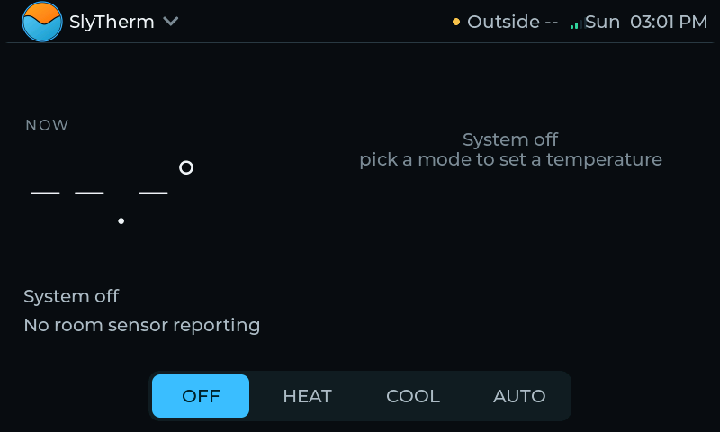

<p align="center">
  
</p>

<h1 align="center">SlyTherm</h1>

<p align="center">
  A custom, <b>local-first</b>, Ecobee-class <b>dual-fuel</b> thermostat — gas heat, heat-pump
  heat, and cooling — for a <b>Dettson Chinook</b> modulating gas furnace paired with a
  <b>Gree</b> heat pump, with balance-point changeover between fuels. A wall-mounted
  <b>ESP32-S3</b> touchscreen at the OEM thermostat location, integrated with
  <b>Home Assistant</b> over MQTT.
</p>

<p align="center">
  
</p>

> ⚠️ **Safety first — read [`docs/04-safety.md`](docs/04-safety.md) before touching the furnace.**
> This is a **gas appliance** plus a **compressor-bearing heat pump**. We never command the gas
> valve directly — we send a *heat demand* over CT-485 and the furnace's certified IFC retains
> **all** combustion safety interlocks. The prime directive is **fail-to-no-demand**, never
> violating compressor minimum timers. The CT-485 stack boots **silent / listen-only** and never
> transmits without an explicit gated opt-in (`SLYTHERM_CT485_TX_ENABLE`).

---

## What it is

SlyTherm replaces the OEM thermostat on a dual-fuel (gas + heat-pump) HVAC system with a custom
controller that keeps **all control on the edge** — no cloud — while integrating cleanly with
Home Assistant over MQTT. The furnace speaks **ClimateTalk / CT-485** over RS-485 (`R`/`C`/`1`/`2`);
SlyTherm sniffs and decodes that bus, fuses temperature + occupancy from multiple room sensors,
and drives the right stage (heat pump vs. modulating gas) with the correct lockouts.

**The heat pump is not assumed to be on the CT-485 bus.** Which architecture is installed
determines the control path:

- **Path A — communicating:** Dettson Alizé ODU + K03085 interface board → the heat pump is a
  CT-485 node commanded by bus demand messages.
- **Path B — conventional/hybrid:** Gree FLEXX ODU on 24 V → CT-485 (or the 24 V "V" signal) for
  the gas furnace plus 24 V relays (Y1/Y2/B/G) with D-wire defrost sensing for the heat pump.

## Hardware

| Part | Detail |
|------|--------|
| Wall unit | **Waveshare ESP32-S3-Touch-LCD-4.3B** — 800×480 RGB, GT911 touch, 16 MB flash / 8 MB PSRAM |
| Furnace | Dettson Chinook **C105-MV** modulating gas + ECM (IFC R99G014) |
| Heat pump | Gree, on 24 V |
| Bus | **CT-485 / ClimateTalk** over RS-485, external 3.3 V transceiver (explicit DE/RE) |
| Satellite (planned) | Guition **JC-ESP32P4-M3** (ESP32-P4 + C6, 32 MB PSRAM) — room panels |

## Features

- **Mode-aware home screen** — big fused current temperature, per-mode setpoint cards (Heat / Cool / Auto), presence-driven "what's being tracked".
- **Multi-room sensor fusion** — temperature + occupancy from MQTT room sensors, dominant-room following, graceful degrade to the local DS18B20.
- **Dual-fuel logic** — heat-pump/gas selection with compressor lockout, minimum timers, and outdoor-temp gating.
- **Home Assistant / MQTT** — auto-discovered climate entity, retained sensor & preset rosters, mDNS broker discovery, no-cloud remote via WireGuard/Tailscale.
- **Pull-down navigation** — tap the logo for a screen menu; swipe between screens; ambient screensaver mirroring the home hero.
- **Local security** — PIN lock makes a locked system read-only until unlocked.
- **On-device diagnostics** — plain-language alarms, CT-485 bus monitor, link health; live screenshots over WiFi (`tools/slyshot.py`).

## Status

🟢 **Active development.** Wall-unit firmware + LVGL UI are running on hardware; control runs
**demands-disabled** and the CT-485 bus is **listen-only** pending transceiver bring-up. Phase 0
equipment inventory is complete (furnace C105-MV, CT-485 confirmed). Roadmap in
[Issues](https://github.com/SlyWombat/SlyTherm/issues).

## Repo layout

```
lib/         pure C++17 modules (no Arduino.h) — fusion, mode logic, CT-485, UiModel; host-testable
src/         firmware entrypoints + Arduino glue (main_thermostat.cpp, slytherm_ui.cpp, sniffer)
docs/        design docs, UI flow mockups, screenshots, assets
tools/       slyshot.py (WiFi screenshot puller) + release/flash helpers
test/        Unity host tests (pio test -e native)
web/         browser-based flasher (ESP Web Tools)
```

## Build & flash

```bash
pio test -e native                    # host unit tests (no hardware)
pio run  -e thermostat_s3             # build the wall unit (ESP32-S3)
# flash the app slot only (preserves WiFi / broker NVS):
esptool --chip esp32s3 --port <PORT> write_flash 0x10000 .pio/build/thermostat_s3/firmware.bin
```

Live screenshot over WiFi: `tools/slyshot.py <ip> out.png <screen 0-5>` (see `docs/screenshots/`).
No-toolchain option: the [`web/installer/`](web/installer/) browser flasher.

## Documentation

| Doc | What's in it |
| --- | --- |
| [`docs/01-architecture.md`](docs/01-architecture.md) | System overview, data flow, design decisions |
| [`docs/02-protocol-climatetalk.md`](docs/02-protocol-climatetalk.md) | CT-485 framing, Fletcher checksum, message/command IDs, sniffing methodology |
| [`docs/03-hardware-wiring.md`](docs/03-hardware-wiring.md) | Wiring, power, RS-485 interface, pin map, isolation |
| [`docs/04-safety.md`](docs/04-safety.md) | Functional-safety review, failure modes & failsafes |
| [`docs/05-firmware-plan.md`](docs/05-firmware-plan.md) | Phased firmware plan, module layout, PlatformIO setup |
| [`docs/06-home-assistant.md`](docs/06-home-assistant.md) | MQTT discovery, HA climate entity, diagnostics |
| [`docs/08-firmware-platform-decision.md`](docs/08-firmware-platform-decision.md) | Decision record: custom PlatformIO + LVGL for the wall unit |
| [`docs/ui-flows/`](docs/ui-flows/) | Locked UI mockups (home, nav, presets, sensors, diag) |
| [`docs/ORDERING.md`](docs/ORDERING.md) | Bill of materials with purchasing links |

## Reference prior art

- [`kdschlosser/ClimateTalk`](https://github.com/kdschlosser/ClimateTalk) — Python protocol model (message/command tables)
- [`kpishere/Net485`](https://github.com/kpishere/Net485) — C++ HVAC RS-485 (physical layer + Fletcher checksum + token state machine)
- [`esphome-econet`](https://github.com/esphome-econet/esphome-econet) — Rheem EcoNet (a ClimateTalk variant; RS-485 plumbing reference)

---

*Part of the ElectricRV project family. Secrets (`.env`, `*_secrets.h`) are gitignored.*
