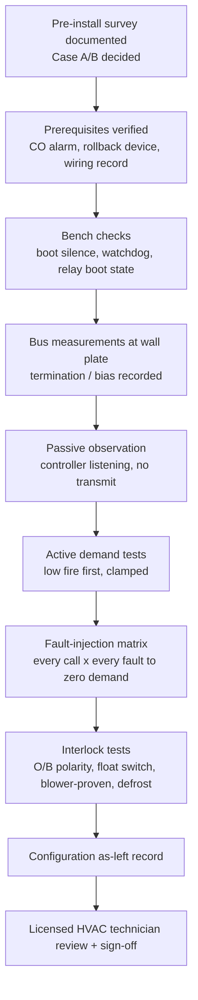

# 10. Commissioning

Commissioning is **not optional**. The DT-1's safety case rests on behaviors
that must be **proven on the installed equipment** — most importantly that
every demand channel reaches zero under every induced fault. The system must
not be left in service until every item below is signed off, and a licensed
HVAC technician has reviewed the installation.

Bring: oscilloscope or logic analyzer (for the boot-silence and relay
boot-state checks), multimeter, and a means of inducing the faults below.
Record every result; the completed tables in 10.6 are the commissioning
record.

## 10.1 Commissioning sequence

## 10.2 Prerequisites (verify before any active test)

| # | Prerequisite | ✔ |
| --- | --- | --- |
| P1 | Pre-install survey complete and documented: architecture (Case A/B), thermostat and outdoor-unit models, IFC DIP states, full low-voltage wiring map, wall-plate conductor count | ☐ |
| P2 | CO alarm installed in the dwelling and tested | ☐ |
| P3 | OEM thermostat retained on site; rollback procedure (Section 11) known **and rehearsed** | ☐ |
| P4 | Bus termination/bias measurements at the wall plate recorded (Section 5.5) | ☐ |
| P5 | Demand-message format confirmed from captures of the installed equipment (engineering gate — see Pending-verification notes); controller verified silent-listening until then | ☐ |
| P6 | Confirmed by observation/capture that the furnace IFC enforces flame/limit/pressure independently of the bus | ☐ |
| P7 | OEM communicating thermostat **removed from the bus** before any controller transmission (one master only) | ☐ |

## 10.3 Bench / boot-state checks

**C1 — Boot silence (scope check).**
1. Connect the scope across the bus A–B at the controller tap.
2. Power-cycle and hard-reset the controller several times.
3. **Pass:** not one byte appears on the bus during boot/reset; the DE line
   stays in the receive/idle state (resistor pull) throughout.

**C2 — Hardware watchdog forces no-demand (hang test).**
1. Use the firmware's test hook (or halt the processor) to stop watchdog
   petting while a heat call is active.
2. **Pass:** on timeout the watchdog hardware forces DE off (bus goes
   silent) **and** (Case B) cuts the relay-coil feed (all relays open) —
   and the equipment subsequently drops the call.

**C3 — Relay boot state (Case B).**
1. Scope (or watch the sense inputs on) all relay outputs through several
   power-ups, resets, and brownouts.
2. **Pass:** every relay coil remains de-energized through boot/reset; no
   contact closes transiently.

**C4 — Reset-loop lockout.**
1. Force 3 resets within the 30-minute window.
2. **Pass:** the controller latches NO-DEMAND and requires a manual clear.

**C5 — Brownout behavior.**
1. Sag the supply mid-call; restore.
2. **Pass:** controller boots to no-demand, validates mode/setpoints/sensors
   before any demand, cross-checks the restored mode against outdoor
   lockouts, and enforces the compressor hold-off if timer state was lost.

**C6 — Compressor minimum-off across reboot.**
1. Stop a compressor call, then power-cycle the controller during the
   minimum-off period.
2. **Pass:** after reboot the hold-off resumes (or restarts in full); no
   compressor demand is emitted early.

**C7 — Mutual-exclusion invariant.**
1. Using the firmware test hook, attempt to command gas heat and compressor
   heat simultaneously.
2. **Pass:** the controller zeros all channels and raises an alarm.

**C8 — Firmware-update policy.**
1. Attempt an over-the-air update while a demand is active → **must be
   refused/deferred**.
2. Confirm the watchdog stays armed throughout an accepted update, and
   exercise the automatic rollback (unconfirmed image → previous firmware)
   once on the bench.

## 10.4 The fault-injection matrix (core acceptance test)

For **each equipment call** {furnace heat, HP heat, HP cool, aux/backup
heat}, induce **each fault** below mid-call and confirm: the call drops to
**zero demand** (bus silent / relays open, equipment ramps down via its own
logic), and recovery honors the compressor timers.

| ↓ fault \ call → | Furnace heat | HP heat | HP cool | Aux/backup |
| --- | --- | --- | --- | --- |
| Pull bus mid-call | ☐ | ☐ | ☐ | ☐ |
| Controller hang (HW watchdog) | ☐ | ☐ | ☐ | ☐ |
| Sensor fault / flap | ☐ | ☐ | ☐ | ☐ |
| MQTT loss | ☐ | ☐ | ☐ | ☐ |
| Brownout / power-cycle mid-call | ☐ | ☐ | ☐ | ☐ |

**Per-row procedures:**

- **Pull bus mid-call:** with the call active and stable, disconnect the
  controller's bus tap (terminals 1/2). Observe at the equipment that the
  call drops within its communications-loss timeout. **This row also
  answers a standing open question:** confirm silence drops the call at
  **both** the furnace and the heat-pump/interface-board side — the bus's
  coordinator topology may not propagate silence to the non-coordinator
  unit. ⚠ **Any cell that fails means that channel needs a hardware
  call-removal path before the system may be left in service** (Section
  1.7).
- **Controller hang:** as test C2, repeated per active call.
- **Sensor fault / flap:** unplug the local fallback sensor, kill the remote
  sensors (stop the HA bridge), and flap a remote sensor in and out. On
  quorum loss the active call must drop to zero with an alarm; a flapping
  sensor must **not** short-cycle the compressor through the failsafe path
  (recovery waits out minimum-off).
- **MQTT loss:** stop the broker mid-call. No demand may *rise*; after the
  staleness window the fallback setpoint profile governs; the active call
  behaves per that profile. Restore and confirm clean recovery.
- **Brownout / power-cycle mid-call:** as test C5, repeated per active call.

## 10.5 Equipment interlock tests

**E1 — O/B reversing-valve polarity.**
1. With the compressor **idle**, set the configured polarity (default:
   B = energized in heating — Gree convention).
2. Command a heat-pump heat call; verify warm supply air / correct
   refrigerant direction. Command cooling; verify cooling.
3. **Pass:** heating heats and cooling cools. A wrong guess inverts both.
   Never switch O/B with the compressor running.

**E2 — Condensate float switch (cooling enabled, either case).**
1. Lift/trip the float manually during an active cooling call.
2. **Pass:** the cooling call is broken **with the firmware unaware** — the
   hardwired series path opens the call regardless of software; any sense
   input is for alarming only.

**E3 — Blower-proven interlock.**
1. Command cooling while preventing/blocking blower confirmation (e.g.,
   suppress the bus blower telemetry or the G/Y feedback per case).
2. **Pass:** the cooling call is refused or dropped without blower
   confirmation.

**E4 — Defrost ride-through.**
1. Force a defrost cycle from the outdoor unit's service procedure ("FO 3
   Force Cycle" class).
2. **Pass:** the controller detects defrost (bus signature or D/W sense),
   holds steady, does not disrupt the cycle, and any tempering stays within
   the configured fixed demand and 15-minute cap. Record who commanded
   tempering (controller vs interface board) — this closes a documented
   open question.

**E5 — Demand-discipline spot checks.**
Confirm the demand clamp (gas 0 or 40–100 % only), per-equipment maximum
runtime policy, anti-short-cycle timers, and per-channel demand refresh are
active (firmware diagnostics page / HA diagnostics).

## 10.6 Final sign-off

| # | Item | Result / value | Initials |
| --- | --- | --- | --- |
| S1 | Prerequisites P1–P7 complete | | |
| S2 | C1 boot silence — scope-verified | | |
| S3 | C2 watchdog no-demand (DE off + coil-cut if Case B) | | |
| S4 | C3 relay boot state (Case B) | | |
| S5 | C4 reset-loop lockout | | |
| S6 | C5 brownout-to-safe | | |
| S7 | C6 min-off across reboot | | |
| S8 | C7 mutual exclusion | | |
| S9 | C8 update policy + rollback exercised | | |
| S10 | 10.4 matrix — **all 20 cells** reach zero demand | | |
| S11 | E1 O/B polarity verified on installed equipment | | |
| S12 | E2 float switch kills cooling, firmware unaware | | |
| S13 | E3 blower-proven interlock | | |
| S14 | E4 defrost observed and not disrupted | | |
| S15 | E5 demand-discipline checks | | |
| S16 | Configuration as-left values recorded (Section 8) | | |
| S17 | Bus termination/bias measurements recorded (Section 5.5) | | |
| S18 | Homeowner briefed: alarms, loss-of-heat behavior, rollback | | |
| S19 | **Licensed HVAC technician review** — name/licence recorded | | |
